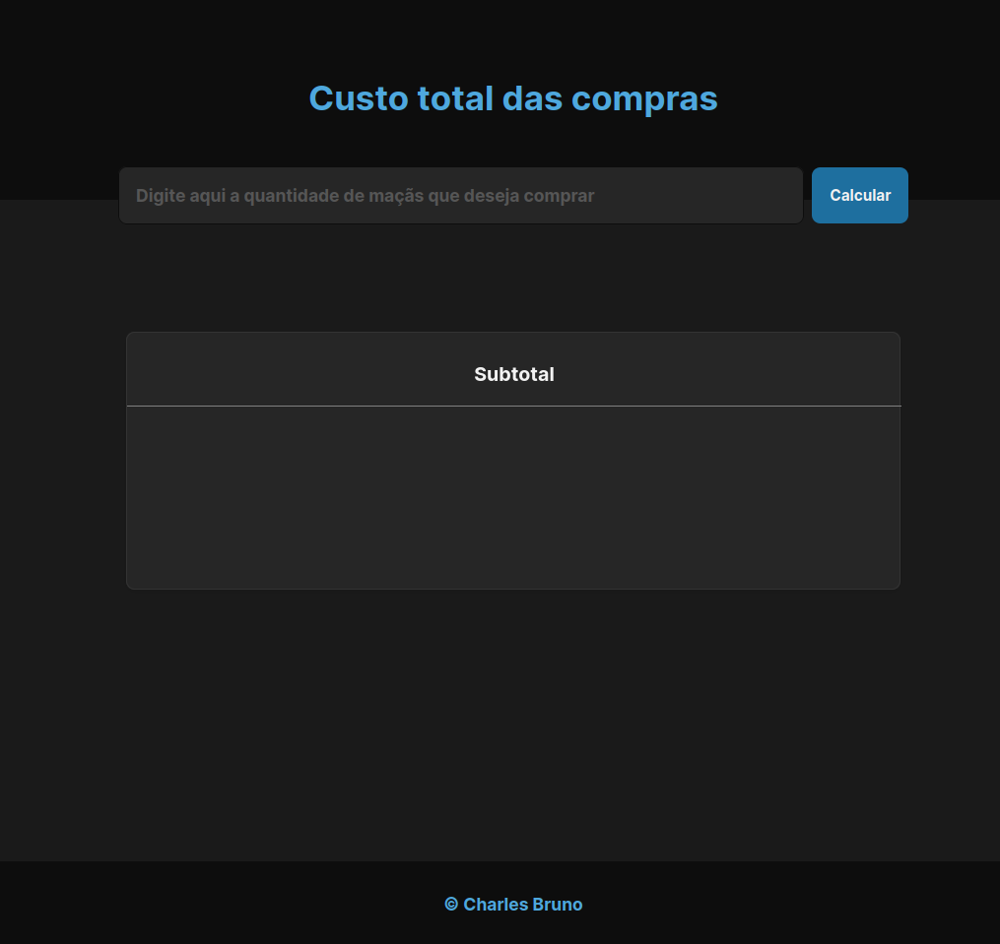

# Desafio - Acelera ZG 5.0

## Tecnologias utilizadas

<h3>O desafio <strong>Acelera ZG 5.0</strong> tem como objetivo transformar estudantes em verdadeiros desenvolvedores.</h3>

<h3>Osbre o projeto</h3>

Um sistema simples para efetuar o cálculo do custo da compras de maçãs. O valor unitário da maçã é R$ 1.30, caso compre a partir de 12 maçãs, o preço fica no valor de R$ 1.00 cada. 

<h3>Funcionamento do projeto</h4>

Para a visualização e o funcionamento do projeto <strong>gupy-desafio</strong>basta instalar a <strong>extensão live server;</strong> após a instalação, clique com o botão direito em cima do <strong>index.html</strong> e escolha a opção <strong>Open with live server para abrir o projeto</strong>

<h3>Desafio - Acelerea ZG 5.0</h3>
